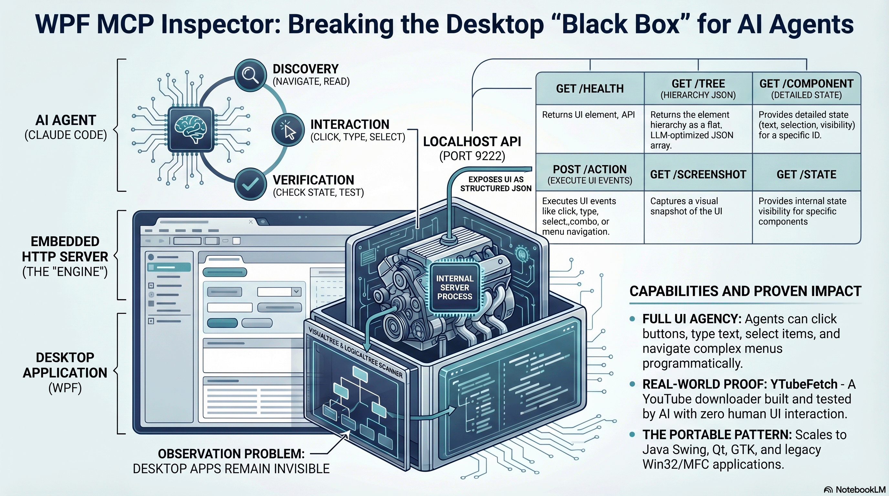

# WPF MCP Inspector

Lightweight MCP server for inspecting and interacting with WPF applications via the UI Automation API.

## Why This Exists

JavaScript developers have it figured out. Their AI agents launch a browser, open DevTools, inspect the DOM, click elements, read state, fix code, and repeat, all programmatically. Desktop applications have none of this. WPF, Java Swing, Qt, GTK, Win32 are black boxes to AI agents. The only option is pixel-based screen scraping: screenshots, mouse coordinates, OCR. Fragile, slow, and lossy.

This matters because desktop applications still power critical workflows, and they are locked out of the agentic AI development loop where an agent writes code, launches the app, inspects the result, identifies issues, fixes the code, and repeats until it works.

WPF MCP Inspector fixes this for WPF by embedding an HTTP server directly inside any WPF application. One call and the entire UI becomes accessible as structured JSON data. AI agents get the same powers over WPF apps that browser DevTools give over web apps: read the visual tree, inspect element state, execute actions by name, and capture screenshots.

This is the same approach used in the [java-swing-mcp](https://github.com/vkorost/java-swing-mcp) project, which does the same for Java Swing applications. For a deeper discussion of why fat client applications are invisible to AI agents and how this pattern addresses it, see [The Fat Client Problem](docs/fat_client_rewrite_essay.md) essay and the [Architecture Deep-Dive](https://github.com/vkorost/java-swing-mcp/blob/master/docs/ARCHITECTURE.md) in that project.

The port number 9222 is intentional: the same default port used by Chrome DevTools Protocol.

## Video Overview

[](https://www.youtube.com/watch?v=YZI6vZ9xh0E)

## Real-World Usage

[YTubeFetch](https://github.com/vkorost/ytubefetch) is a WPF desktop application that was developed and tested using this inspector. Claude Code used the MCP server to interact with YTubeFetch's download queue, toggle panels, preferences dialogs, and system tray integration during the entire build process.

## Quick Start

```csharp
using WpfMcpInspector;

// After your MainWindow is shown:
var server = new McpServer(mainWindow);
server.AppName = "MyApp";
server.Start();

// On shutdown:
server.Dispose();
```

Then from a terminal:

```bash
curl http://localhost:9222/health
curl http://localhost:9222/tree
curl -X POST http://localhost:9222/action -d '{"action":"click","target":"SubmitButton"}'
```

## Endpoints

| Method | Path                    | Description                                    |
|--------|-------------------------|------------------------------------------------|
| GET    | `/health`               | Server status, uptime, component count         |
| GET    | `/tree`                 | Visual tree (filterable by type/interactable)   |
| GET    | `/component/{nameOrId}` | Detailed state of a single element              |
| POST   | `/action`               | Execute a UI action (click, type, select, etc.) |
| GET    | `/screenshot`           | Capture window or component as base64 PNG       |
| GET    | `/state`                | Custom app state (via AppStateProvider)          |

See [docs/api-reference.md](docs/api-reference.md) for full request/response documentation.

## Supported Actions

- `click` - click a button or invoke an element
- `type` - set text in a TextBox
- `clear` - clear a TextBox
- `select_combo` - select a ComboBox item by index or value
- `select_tab` - select a TabControl tab by index
- `check` / `uncheck` - toggle a CheckBox or ToggleButton
- `select_listitem` - select a ListBox/ListView item by index
- `menu` - navigate and click a menu item by path (e.g. `"File > Save"`)
- `focus` - focus an element

## Custom State Provider

Register an `AppStateProvider` delegate to expose app-specific state:

```csharp
var server = new McpServer(mainWindow, window =>
{
    return new
    {
        CurrentUser = "admin",
        ItemCount = 42,
        IsProcessing = false
    };
});
```

This makes `GET /state` return your custom JSON object.

## Use with Claude Code

The inspector enables Claude Code to develop and test your WPF application by:

1. **Discovering UI** - `GET /tree` returns all interactable elements with names, types, and positions
2. **Reading state** - `GET /component/{name}` returns detailed state (text, checked, selected item, etc.)
3. **Performing actions** - `POST /action` clicks buttons, types text, selects items
4. **Verifying results** - action responses include the updated component state
5. **Visual inspection** - `GET /screenshot` captures the current window state

This creates a tight feedback loop where Claude Code can build, launch, interact with, and verify your WPF application without human intervention.

## Documentation

- [API Reference](docs/api-reference.md) — full endpoint documentation with request/response examples
- [Integration Guide](docs/integration-guide.md) — step-by-step setup for your WPF app
- [Claude Code Testing](docs/claude-code-testing.md) — using the inspector with Claude Code
- [Architecture Diagrams](docs/diagrams.md) — Mermaid diagrams of runtime flow, class structure, thread safety, and data flow
- [The Fat Client Problem](docs/fat_client_rewrite_essay.md) — essay on why desktop apps are invisible to AI agents and how this pattern fixes it

## Project Structure

```
wpf-mcp/
├── WpfMcpInspector.sln                    # Solution file
├── README.md                              # This file
├── LICENSE                                # MIT license
├── .gitignore                             # Build artifacts, IDE files
│
├── src/WpfMcpInspector/                   # Library source (embed this in your app)
│   ├── WpfMcpInspector.csproj             # .NET 8 WPF class library
│   ├── McpServer.cs                       # HTTP server (HttpListener), request routing, lifecycle
│   ├── TreeWalker.cs                      # Visual tree traversal, stable ID assignment, element lookup
│   ├── ComponentInspector.cs              # Per-type state extraction (TextBox, ComboBox, DataGrid, etc.)
│   ├── ActionExecutor.cs                  # UI action execution (click, type, select, menu, check)
│   ├── ScreenshotCapture.cs               # RenderTargetBitmap capture, PNG encoding, base64 output
│   └── Models.cs                          # Data models, request/response records, AppStateProvider delegate
│
├── samples/SimpleWpfApp/                  # Minimal sample app demonstrating MCP integration
│   ├── SimpleWpfApp.csproj                # References WpfMcpInspector as project dependency
│   ├── App.xaml                           # Application definition
│   ├── App.xaml.cs                        # Creates McpServer on startup, disposes on exit
│   ├── MainWindow.xaml                    # Sample UI: TextBox, Button, ComboBox, CheckBox, ListBox, Menu
│   └── MainWindow.xaml.cs                 # Click handlers, form logic for testing
│
└── docs/                                  # Documentation and visual assets
    ├── api-reference.md                   # Complete endpoint docs with curl examples and JSON schemas
    ├── integration-guide.md               # How to add WpfMcpInspector to your own WPF project
    ├── claude-code-testing.md             # Workflow for using Claude Code with the MCP server
    ├── diagrams.md                        # Mermaid architecture diagrams (runtime, classes, threading)
    ├── fat_client_rewrite_essay.md        # Essay: why desktop apps are black boxes to AI agents
    └── wpf-mcp.gif                        # Architecture overview diagram
```

## Building

```bash
dotnet build WpfMcpInspector.sln
```

To try the sample app:

```bash
dotnet run --project samples/SimpleWpfApp/SimpleWpfApp.csproj
```

## Architecture Overview



## License

MIT. See [LICENSE](LICENSE).
