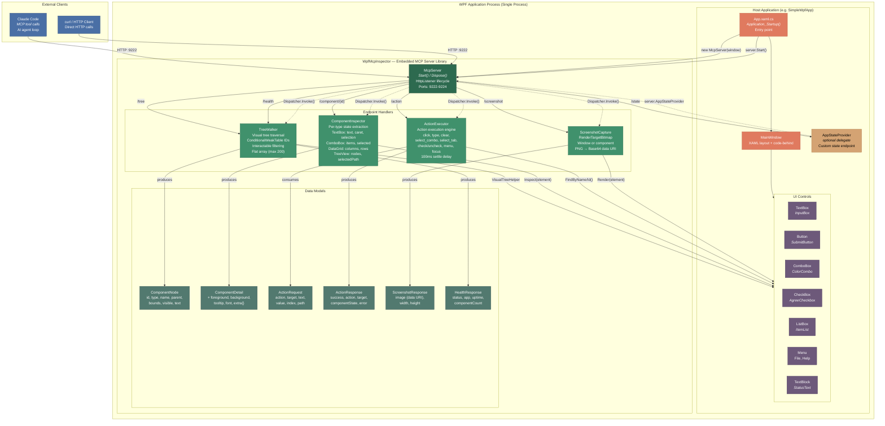
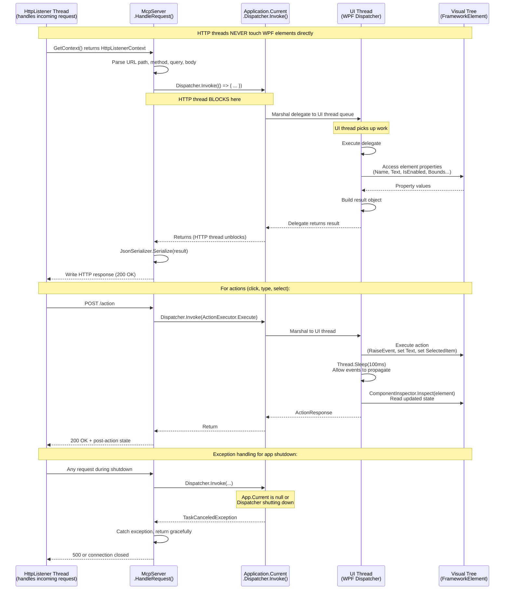
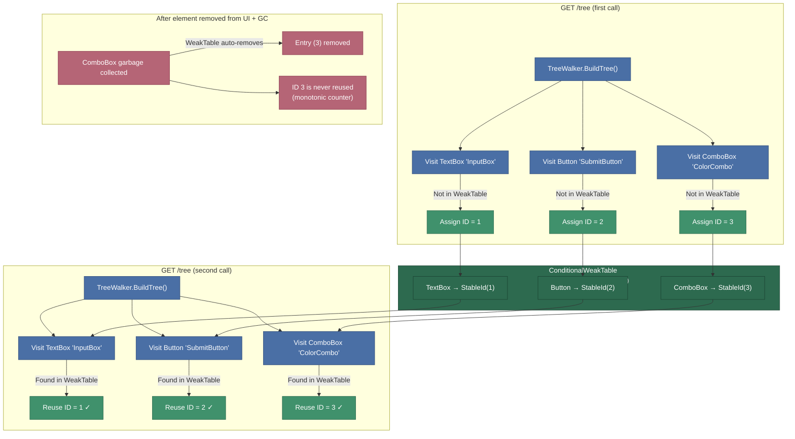

# WPF MCP Inspector Diagrams

## 1. How the MCP Server Works (Runtime Flow)

This diagram shows the runtime interaction between an external client (Claude Code or curl), the embedded HTTP server, the WPF Dispatcher, and the live WPF application.

```mermaid
sequenceDiagram
    participant Client as External Client<br/>(Claude Code / curl)
    participant HTTP as McpServer<br/>(HttpListener Thread)
    participant Disp as WPF Dispatcher<br/>(UI Thread Marshal)
    participant UI as WPF Application<br/>(Visual Tree)
    participant Render as RenderTargetBitmap<br/>(Screen Capture)

    Note over Client,Render: === Startup ===
    UI->>UI: Application_Startup() creates MainWindow
    UI->>HTTP: new McpServer(window).Start()
    HTTP->>HTTP: HttpListener binds localhost:9222-9224

    Note over Client,Render: === GET /tree — Visual Tree ===
    Client->>HTTP: GET /tree?interactable=true
    HTTP->>Disp: Dispatcher.Invoke(BuildTree)
    Disp->>UI: VisualTreeHelper.GetChildrenCount()
    Disp->>UI: Recursive depth-first traversal
    Disp->>UI: Assign stable IDs via ConditionalWeakTable
    Disp-->>HTTP: List<ComponentNode> (flat array, max 200)
    HTTP->>HTTP: JsonSerializer.Serialize (camelCase)
    HTTP-->>Client: 200 OK — JSON TreeResponse

    Note over Client,Render: === GET /component/{name} — Element State ===
    Client->>HTTP: GET /component/InputBox
    HTTP->>Disp: Dispatcher.Invoke(FindByName + Inspect)
    Disp->>UI: TreeWalker.FindByName("InputBox")
    Disp->>UI: ComponentInspector.Inspect(element)
    Disp->>UI: Extract type-specific state<br/>(text, selectedItem, isChecked, items...)
    Disp-->>HTTP: ComponentDetail
    HTTP-->>Client: 200 OK — JSON detail object

    Note over Client,Render: === POST /action — Click Button ===
    Client->>HTTP: POST /action<br/>{"action":"click", "target":"SubmitButton"}
    HTTP->>HTTP: Deserialize ActionRequest
    HTTP->>Disp: Dispatcher.Invoke(ActionExecutor.Execute)
    Disp->>UI: TreeWalker.FindByName("SubmitButton")

    alt ButtonBase (has Click event)
        Disp->>UI: RaiseEvent(ButtonBase.ClickEvent)
    else Other (AutomationPeer)
        Disp->>UI: IInvokeProvider.Invoke()
    end

    Disp->>Disp: Thread.Sleep(100ms) — settle delay
    Disp->>UI: ComponentInspector.Inspect(element)
    Disp-->>HTTP: ActionResponse(success, componentState)
    HTTP-->>Client: 200 OK — JSON with post-action state

    Note over Client,Render: === POST /action — Type Text ===
    Client->>HTTP: POST /action<br/>{"action":"type",<br/>"target":"InputBox", "text":"Hello"}
    HTTP->>Disp: Dispatcher.Invoke(Execute)
    Disp->>UI: TreeWalker.FindByName("InputBox")
    Disp->>UI: TextBox.Text = "Hello"
    Disp->>UI: TextBox.CaretIndex = text.Length
    Disp->>UI: RaiseEvent(TextChangedEvent)
    Disp->>Disp: 100ms settle
    Disp-->>HTTP: ActionResponse with updated text state
    HTTP-->>Client: 200 OK

    Note over Client,Render: === POST /action — Select ComboBox ===
    Client->>HTTP: POST /action<br/>{"action":"select_combo",<br/>"target":"ColorCombo", "value":"Blue"}
    HTTP->>Disp: Dispatcher.Invoke(Execute)
    Disp->>UI: TreeWalker.FindByName("ColorCombo")
    Disp->>UI: ComboBox.SelectedItem = "Blue"<br/>(case-insensitive match)
    Disp->>UI: SelectionChanged event fires
    Disp->>Disp: 100ms settle
    Disp-->>HTTP: ActionResponse with updated combo state
    HTTP-->>Client: 200 OK

    Note over Client,Render: === POST /action — Navigate Menu ===
    Client->>HTTP: POST /action<br/>{"action":"menu",<br/>"target":"_", "path":"File > New"}
    HTTP->>Disp: Dispatcher.Invoke(Execute)
    Disp->>UI: Find Menu in visual tree
    Disp->>UI: Match "File" header (strip _ access keys)
    Disp->>UI: Match "New" in sub-items
    Disp->>UI: RaiseEvent(MenuItem.ClickEvent)
    Disp->>Disp: 100ms settle
    Disp-->>HTTP: ActionResponse
    HTTP-->>Client: 200 OK

    Note over Client,Render: === GET /screenshot — Window Capture ===
    Client->>HTTP: GET /screenshot
    HTTP->>Disp: Dispatcher.Invoke(ScreenshotCapture.Capture)
    Disp->>UI: Measure window ActualWidth/Height
    Disp->>Render: new RenderTargetBitmap(w, h, 96, 96)
    Render->>UI: Render(window)
    Render-->>Disp: Bitmap pixels
    Disp->>Disp: PngBitmapEncoder → byte[]
    Disp->>Disp: Base64 → data:image/png;base64,...
    Disp-->>HTTP: ScreenshotResponse(dataUri, w, h)
    HTTP-->>Client: 200 OK — base64-encoded PNG

    Note over Client,Render: === GET /health — Server Status ===
    Client->>HTTP: GET /health
    HTTP->>Disp: Dispatcher.Invoke(TreeWalker.BuildTree)
    Disp->>UI: Count all visual tree elements
    Disp-->>HTTP: component count
    HTTP->>HTTP: Calculate uptime
    HTTP-->>Client: 200 OK — HealthResponse
```

## 2. How the Server is Designed (Architecture & Class Structure)

This diagram shows the internal class structure, responsibilities, and data flow within the WpfMcpInspector library and its integration with a host application.



## 3. Dispatcher Bridge Pattern (Thread Safety Detail)

This diagram zooms in on the critical Dispatcher bridge pattern that ensures all WPF visual tree access is thread-safe. WPF controls can only be accessed from the thread that created them (the UI thread).



## 4. Data Flow: AI Agent Testing a Form via MCP

This diagram shows the complete data flow when Claude Code tests a WPF form through the MCP server — inspecting controls, filling fields, submitting, and verifying the result.

```mermaid
sequenceDiagram
    participant Agent as Claude Code<br/>(AI Agent)
    participant MCP as MCP Server<br/>(localhost:9222)
    participant Input as TextBox<br/>(InputBox)
    participant Combo as ComboBox<br/>(ColorCombo)
    participant Check as CheckBox<br/>(AgreeCheckbox)
    participant Btn as Button<br/>(SubmitButton)
    participant Status as TextBlock<br/>(StatusText)
    participant List as ListBox<br/>(ItemList)

    Note over Agent,List: Step 1: Discover UI structure
    Agent->>MCP: GET /tree?interactable=true
    MCP->>MCP: Dispatcher.Invoke(TreeWalker.BuildTree)
    MCP-->>Agent: components: [<br/>  {id:1, type:"TextBox", name:"InputBox"},<br/>  {id:2, type:"Button", name:"SubmitButton"},<br/>  {id:3, type:"ComboBox", name:"ColorCombo"},<br/>  {id:4, type:"CheckBox", name:"AgreeCheckbox"},<br/>  ...]

    Note over Agent,List: Step 2: Inspect initial state
    Agent->>MCP: GET /component/InputBox
    MCP->>Input: ComponentInspector.Inspect()
    Input-->>MCP: text:"", isReadOnly:false, enabled:true
    MCP-->>Agent: ComponentDetail with empty text

    Agent->>MCP: GET /component/ColorCombo
    MCP->>Combo: ComponentInspector.Inspect()
    Combo-->>MCP: items:["Red","Green","Blue"],<br/>selectedIndex:0, selectedItem:"Red"
    MCP-->>Agent: ComponentDetail with items list

    Note over Agent,List: Step 3: Fill the form
    Agent->>MCP: POST /action<br/>{"action":"type",<br/>"target":"InputBox", "text":"Test Item"}
    MCP->>Input: TextBox.Text = "Test Item"
    MCP->>Input: CaretIndex = 9
    MCP->>Input: RaiseEvent(TextChanged)
    MCP->>MCP: 100ms settle
    MCP->>Input: Inspect() → text:"Test Item"
    MCP-->>Agent: success:true, text:"Test Item"

    Agent->>MCP: POST /action<br/>{"action":"select_combo",<br/>"target":"ColorCombo", "value":"Blue"}
    MCP->>Combo: Find "Blue" (case-insensitive)
    MCP->>Combo: SelectedItem = "Blue"
    Combo->>Combo: SelectionChanged fires
    MCP->>MCP: 100ms settle
    MCP-->>Agent: success:true, selectedItem:"Blue"

    Agent->>MCP: POST /action<br/>{"action":"check", "target":"AgreeCheckbox"}
    MCP->>Check: IsChecked = true
    Check->>Check: Checked event fires
    MCP->>MCP: 100ms settle
    MCP-->>Agent: success:true, isChecked:true

    Note over Agent,List: Step 4: Take screenshot to verify form state
    Agent->>MCP: GET /screenshot
    MCP->>MCP: Dispatcher.Invoke(Capture)
    MCP->>MCP: RenderTargetBitmap → PNG → Base64
    MCP-->>Agent: data:image/png;base64,iVBOR...

    Note over Agent,List: Step 5: Submit the form
    Agent->>MCP: POST /action<br/>{"action":"click", "target":"SubmitButton"}
    MCP->>Btn: RaiseEvent(ButtonBase.ClickEvent)
    Btn->>Btn: Click handler executes
    Btn->>List: ItemList.Items.Add("Test Item")
    Btn->>Status: StatusText.Text = "Added: Test Item"
    Btn->>Input: InputBox.Text = "" (clear)
    MCP->>MCP: 100ms settle
    MCP-->>Agent: success:true

    Note over Agent,List: Step 6: Verify the result
    Agent->>MCP: GET /component/StatusText
    MCP->>Status: Inspect()
    Status-->>MCP: text:"Added: Test Item"
    MCP-->>Agent: text matches expected value ✓

    Agent->>MCP: GET /component/ItemList
    MCP->>List: Inspect()
    List-->>MCP: itemCount:1, items:["Test Item"]
    MCP-->>Agent: item appears in list ✓

    Agent->>MCP: GET /component/InputBox
    MCP->>Input: Inspect()
    Input-->>MCP: text:""
    MCP-->>Agent: input was cleared after submit ✓

    Note over Agent,List: Step 7: Navigate menu
    Agent->>MCP: POST /action<br/>{"action":"menu",<br/>"target":"_", "path":"File > New"}
    MCP->>MCP: Find Menu → match "File" → match "New"
    MCP->>MCP: RaiseEvent(MenuItem.ClickEvent)
    MCP->>MCP: 100ms settle
    MCP-->>Agent: success:true

    Agent->>MCP: GET /component/ItemList
    MCP->>List: Inspect()
    List-->>MCP: itemCount:0, items:[]
    MCP-->>Agent: list was cleared by "New" ✓
```

## 5. Stable ID Management (ConditionalWeakTable)

This diagram explains how TreeWalker maintains stable element IDs across multiple `/tree` requests without leaking memory.


